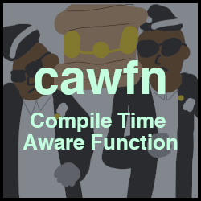
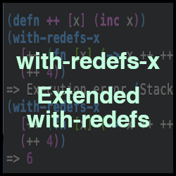
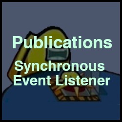

## Portfolio

Below is a list of various functions from various projects that demonstrate some of my work. Click on any of the images to read about that project.

### Inference Algos + Computer Vision

## Clojure

## Java

