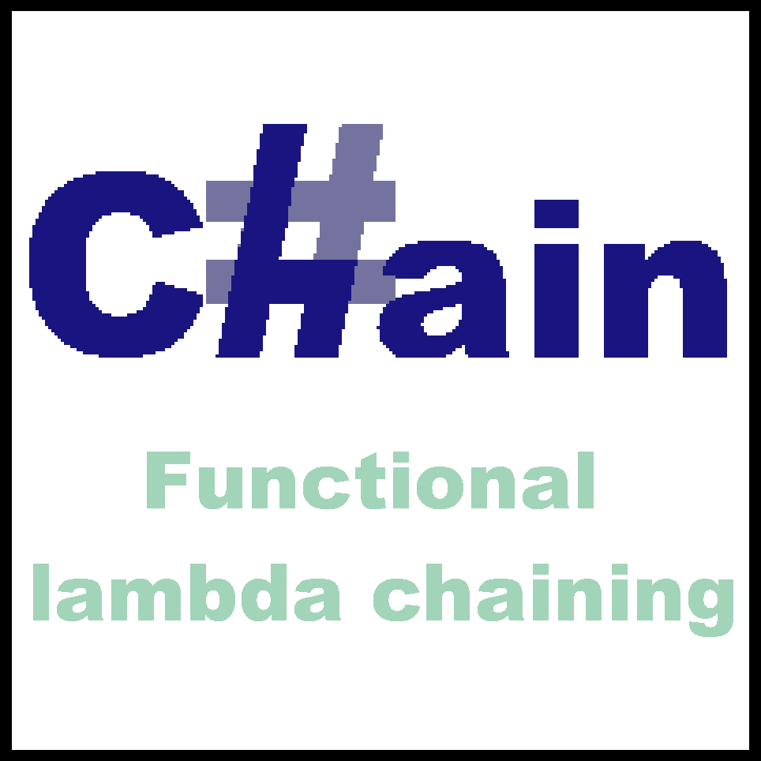
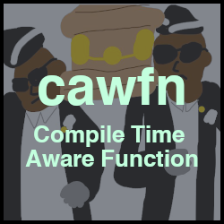
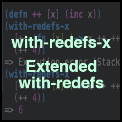

| | |
|----|----|
||[Repository](https://github.com/csulpizi/ChainSharp)   A functional chaining C# library allowing you to chain both synchronous and asynchronous functions together. Enables writing idiomatic lambdas and closures without deeply nested functions or unnecessary bindings.|
||[Repository](https://github.com/csulpizi/cawfn)   A Clojure library that provides a compile-time aware version of `clojure.core/defn`.|
||[Repository](https://github.com/csulpizi/with-redefs-x)  Clojure extension of clojure.core/with-redefs, allowing self-referencing functions for stubbing in tests.|
||[Repository](https://github.com/csulpizi/Python-K-Means-Classifier)  A Python classifier that uses k-means clustering in up to N dimensions to define the decision boundary for each class.|
||[Repository](https://github.com/csulpizi/publications)  A lightweight Java class for broadcasting messages and triggering events synchronously.|

Other projects:
- [Fedora Discord Updater](https://github.com/csulpizi/Fedora-Discord-Updater) Helper shell script for installing / updating discord on fedora
- [Blender Scripts](https://github.com/csulpizi/blender_scripts) A few Blender scripts to speed up workflows
